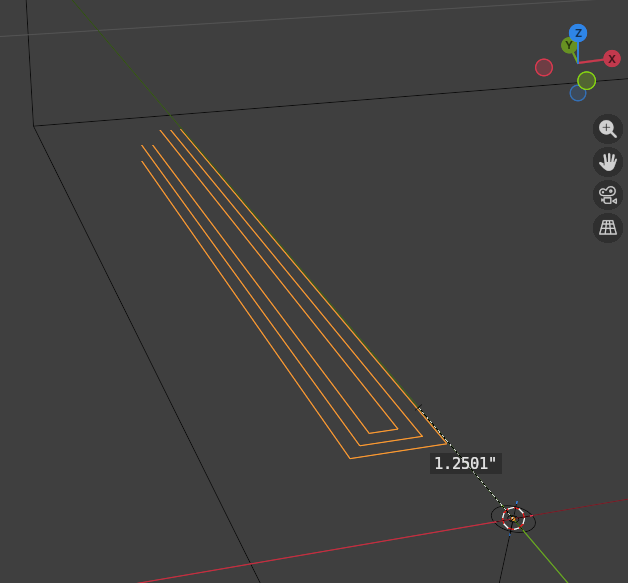

# Cactus Stand Programs

## Cut In Pos X (For Wires)

[Download](./gcode/WireCoversCutInPosX.gcode)

Zero point 1.25" toward -Y from the non-CNC cut.

## Cut In Neg X (For Wires)

[Download](./gcode/WireCoversCutInNegX.gcode)

Zero point 1.25" toward -Y from the non-CNC cut.

Same program as Pos X but mirrored across X axis.

## Cut Out Covers Array

[Download](./gcode/WireCoverCutOutChain.gcode)

Zero point arbitrary but the cuts will be +Y from the zero point. Zero point is offset the same way that [Cut In Pos X](#cut-in-pos-x-for-wires) is offset.

Cuts 4 covers in one program.

