# Cactus Stand Programs

- [Cactus Stand Programs](#cactus-stand-programs)
  - [Design and Channel Cuts](#design-and-channel-cuts)
    - [Short Design and Channel Cut Chain](#short-design-and-channel-cut-chain)
    - [Long Design and Channel Cut Chain Pos Y](#long-design-and-channel-cut-chain-pos-y)
    - [Long Design and Channel Cut Chain Neg Y](#long-design-and-channel-cut-chain-neg-y)
  - [Clearing Cuts](#clearing-cuts)
    - [Short Clearing Cut](#short-clearing-cut)
    - [Long Clearing Cut Pos Y](#long-clearing-cut-pos-y)
    - [Long Clearing Cut Neg Y](#long-clearing-cut-neg-y)
  - [Cut In Pos X (For Wires)](#cut-in-pos-x-for-wires)
  - [Cut In Neg X (For Wires)](#cut-in-neg-x-for-wires)
  - [Cut Out Covers Array](#cut-out-covers-array)
  - [Wire Covers Screws Array](#wire-covers-screws-array)
  - [Rectangle cut](#rectangle-cut)
    - [Rectangle Neg Y](#rectangle-neg-y)
    - [Rectangle Pos Y](#rectangle-pos-y)

---

## Design and Channel Cuts

### Short Design and Channel Cut Chain

**Bit: 1/16".**

Zero point touching the -X edge, and centered on material's Y.

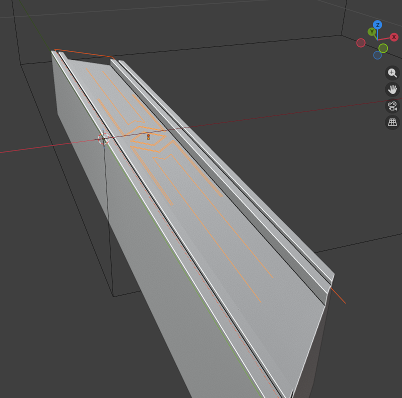

[Download](./gcode/CactusStand/ShortChannelsAndDesign.0625.gcode)

---

### Long Design and Channel Cut Chain Pos Y

**Bit: 1/16".**

Zero point touching the -X edge, and centered on material's Y.

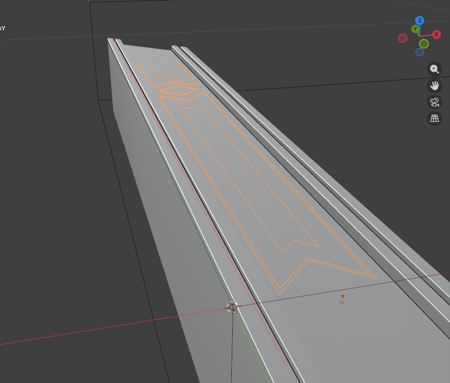

[Download](./gcode/CactusStand/LongChannelsAndDesignPosY.0625.gcode)

### Long Design and Channel Cut Chain Neg Y

**Bit: 1/16".**

Zero point touching the -X edge, and centered on material's Y.

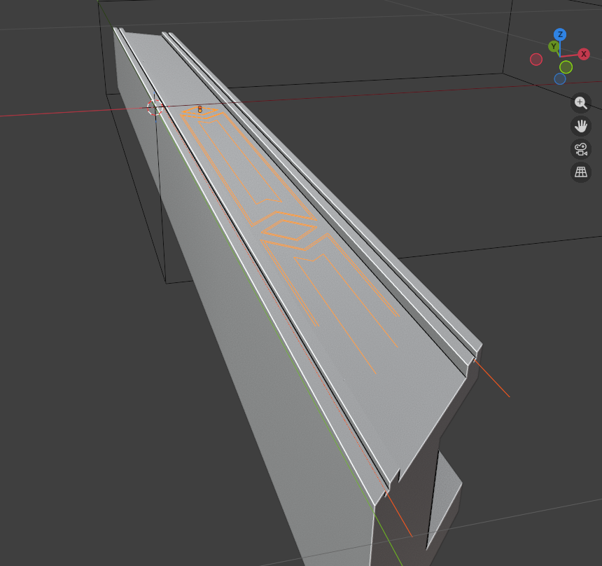

[Download](./gcode/CactusStand/LongChannelsAndDesignNegY.0625.gcode)

---

## Clearing Cuts

### Short Clearing Cut

**Bit: 1/4".**

Zero point touching the -X edge, and centered on material's Y.

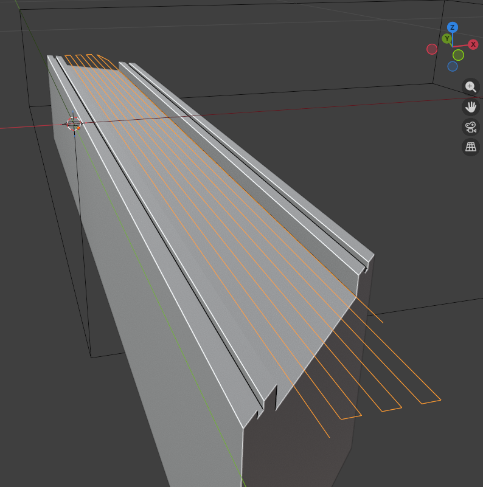

[Download](./gcode/CactusStand/ShortClearing.25.gcode)

### Long Clearing Cut Pos Y

**Bit: 1/4".**

Zero point touching the -X edge, and centered on material's Y.

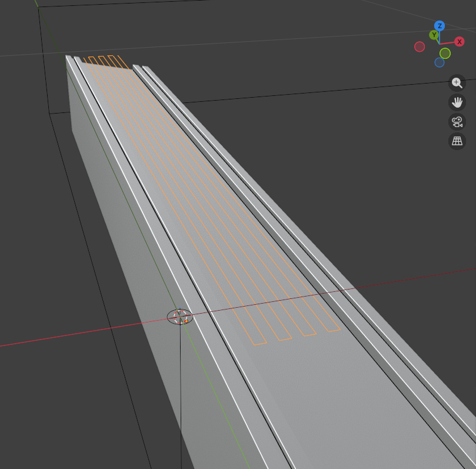

[Download](./gcode/CactusStand/LongClearingPosY.25.gcode)

### Long Clearing Cut Neg Y

**Bit: 1/4".**

Zero point touching the -X edge, and centered on material's Y.

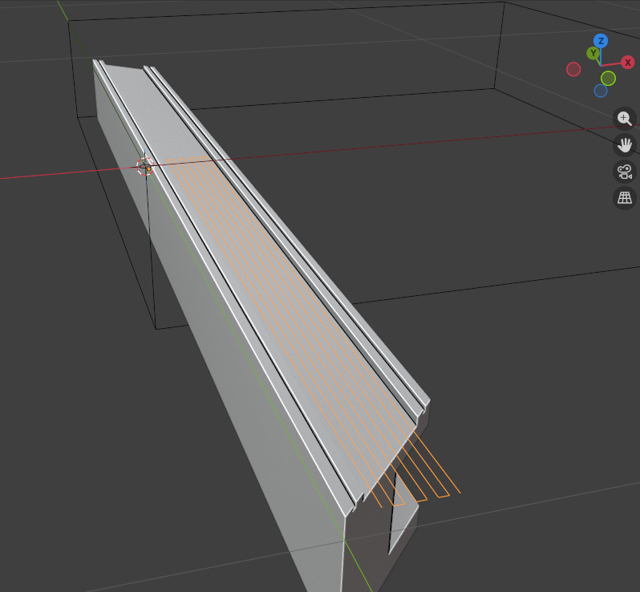

[Download](./gcode/CactusStand/LongClearingNegY.25.gcode)

---

## Cut In Pos X (For Wires)

**Bit: 1/4".**

Zero point 1.25" toward -Y from the non-CNC cut.

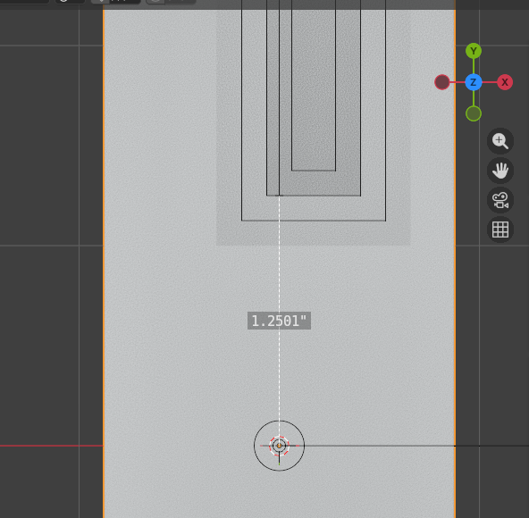

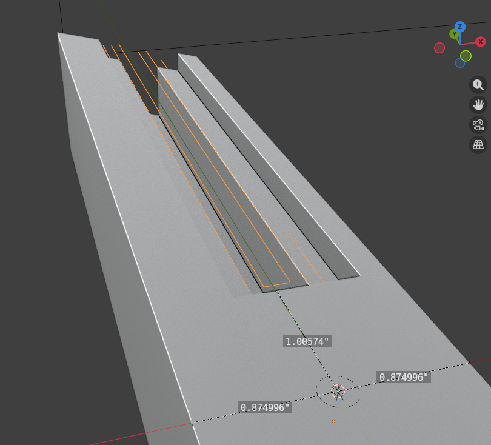

[Download](./gcode/CactusStand/WireCoversCutInPosX.gcode)

## Cut In Neg X (For Wires)

**Bit: 1/4".**

Zero point 1.25" toward -Y from the non-CNC cut.

Same program as Pos X but mirrored across X axis.

[Download](./gcode/CactusStand/WireCoversCutInNegX.gcode)

---

## Cut Out Covers Array

**Bit: 1/8".**

Zero point arbitrary but the cuts will be +Y from the zero point. Zero point is offset the same way that [Cut In Pos X](#cut-in-pos-x-for-wires) is offset.

Cuts four covers in one program.

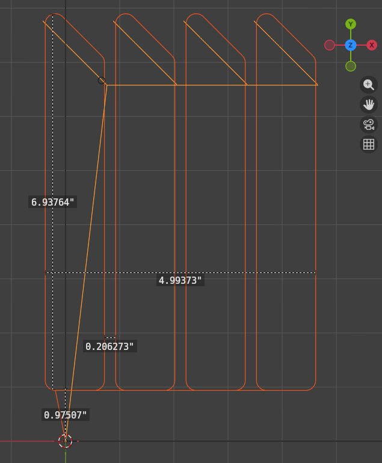

[Download](./gcode/CactusStand/WireCoverCutOutChain.gcode)

## Wire Covers Screws Array

**Bit: 1/16".**

Zero point the same as with the [Cut Out Covers Array](#cut-out-covers-array).

Zero point arbitrary but the cuts will be +Y from the zero point. Zero point is offset the same way that [Cut In Pos X](#cut-in-pos-x-for-wires) is offset.

Cuts the screw positions for four covers in one program.

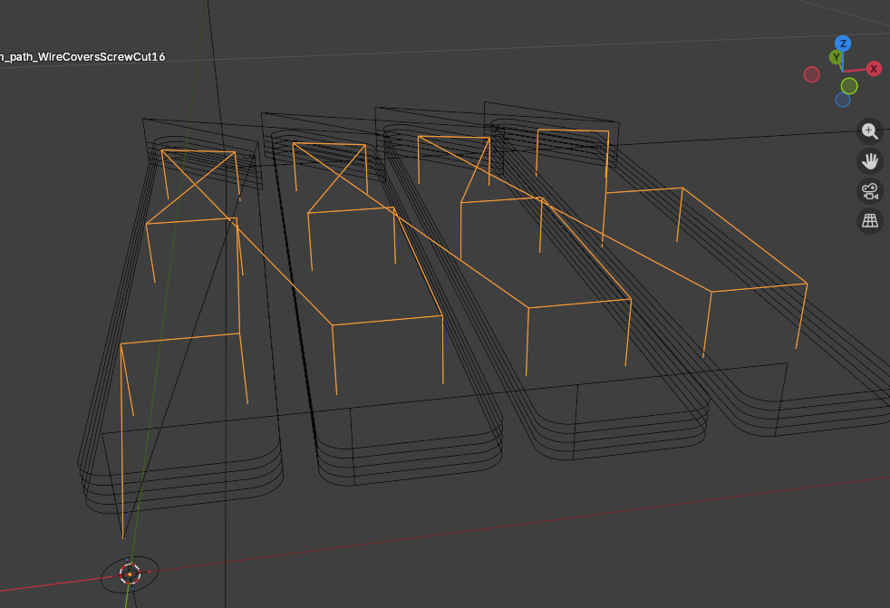

[Download](./gcode/CactusStand/WireCoversScrewCut16.gcode)

---

## Rectangle cut

### Rectangle Neg Y

**Bit: 1/8".**

**Depth: 1/8".**

Zero point: Center of material/rectangle to be cut.

Cuts Negative Y half of 20.5" by 6.75" rectangle. 

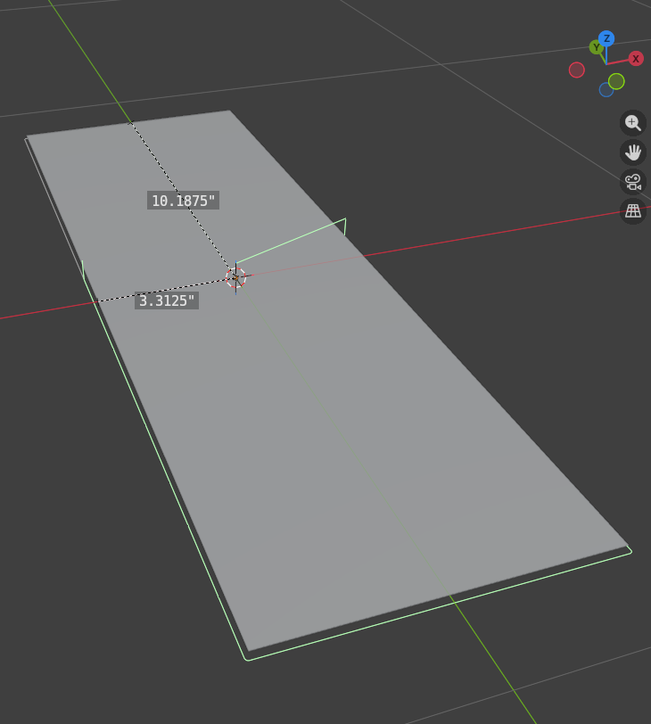

[Download](./gcode/CactusStand/RectangleCutNegY.gcode)

### Rectangle Pos Y

**Bit: 1/8".**

**Depth: 1/8".**

Zero point: Center of material/rectangle to be cut.

Cuts Positive Y half of 20.5" by 6.75" rectangle. 

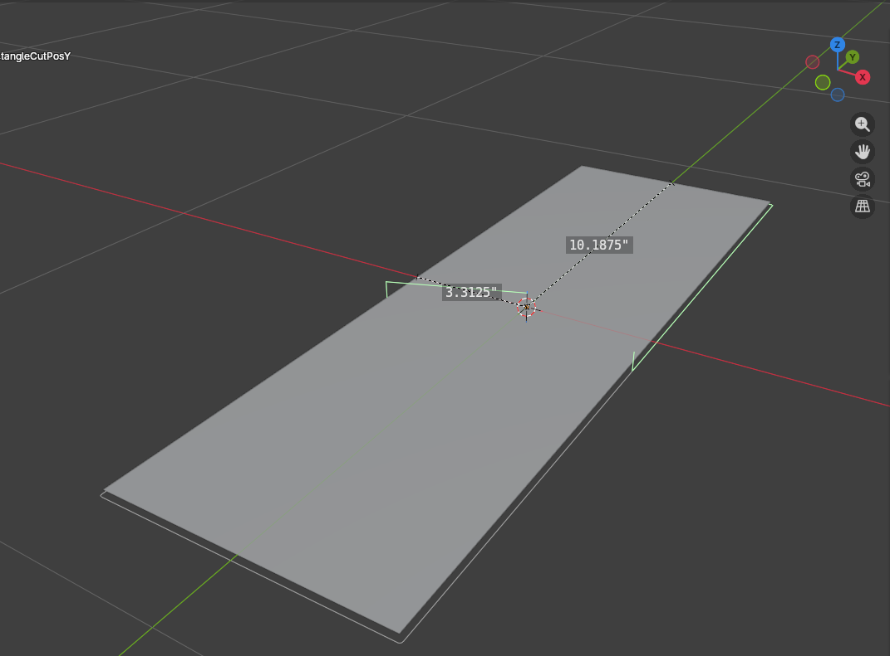

[Download](./gcode/CactusStand/RectangleCutPosY.gcode)