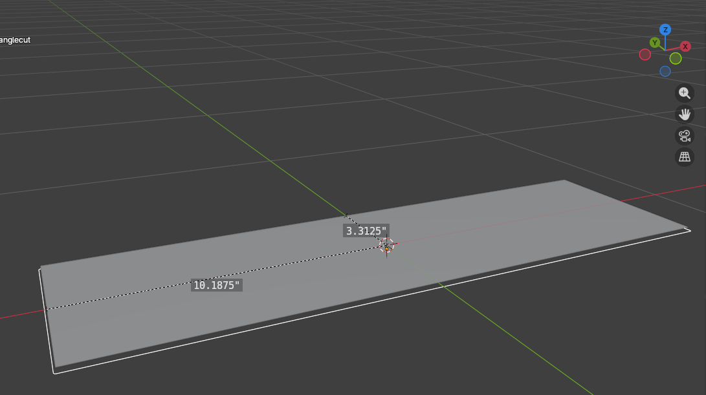

# Cactus Stand Programs

- [Cactus Stand Programs](#cactus-stand-programs)
  - [Cut In Pos X (For Wires)](#cut-in-pos-x-for-wires)
  - [Cut In Neg X (For Wires)](#cut-in-neg-x-for-wires)
  - [Cut Out Covers Array](#cut-out-covers-array)
  - [Wire Covers Screws Array](#wire-covers-screws-array)
  - [Rectangle cut](#rectangle-cut)

## Cut In Pos X (For Wires)

[Download](./gcode/CactusStand/WireCoversCutInPosX.gcode)

**Bit: 1/4".**

Zero point 1.25" toward -Y from the non-CNC cut.

## Cut In Neg X (For Wires)

[Download](./gcode/CactusStand/WireCoversCutInNegX.gcode)

**Bit: 1/4".**

Zero point 1.25" toward -Y from the non-CNC cut.

Same program as Pos X but mirrored across X axis.

## Cut Out Covers Array

[Download](./gcode/CactusStand/WireCoverCutOutChain.gcode)

**Bit: 1/8".**

Zero point arbitrary but the cuts will be +Y from the zero point. Zero point is offset the same way that [Cut In Pos X](#cut-in-pos-x-for-wires) is offset.

Cuts four covers in one program.

## Wire Covers Screws Array

[Download](./gcode/CactusStand/WireCoversScrewCut16.gcode)

**Bit: 1/16".**

Zero point the same as with the [Cut Out Covers Array](#cut-out-covers-array).

Zero point arbitrary but the cuts will be +Y from the zero point. Zero point is offset the same way that [Cut In Pos X](#cut-in-pos-x-for-wires) is offset.

Cuts the screw positions for four covers in one program.

## Rectangle cut

[Download](./gcode/CactusStand/RectangleCut.gcode)

**Bit: 1/8".**

**Depth: 1/8".**

Zero point: Center of material/rectangle to be cut.

Cuts 20.5" by 6.75" rectangle. 

